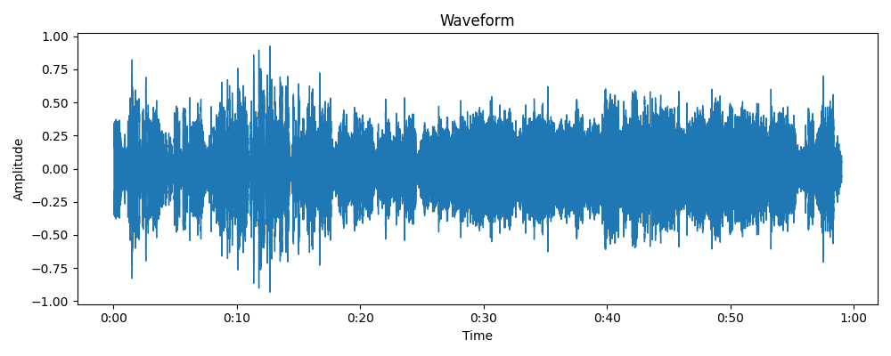
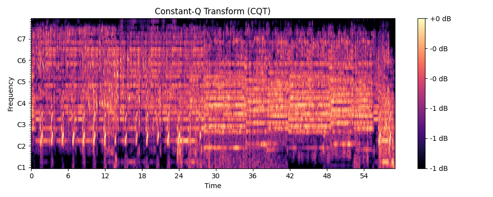
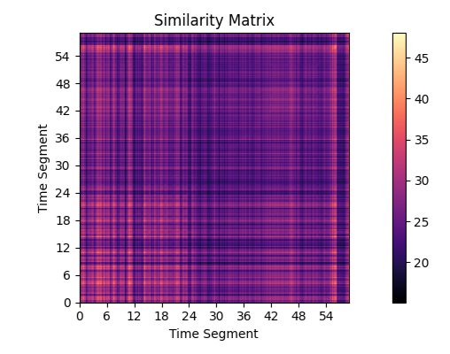
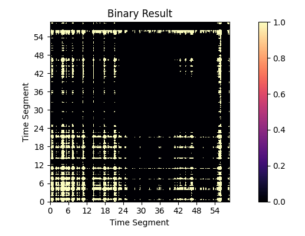
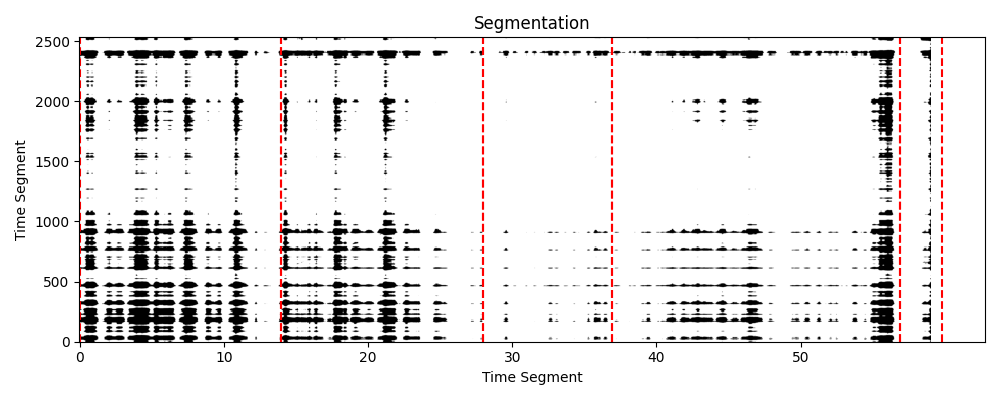

# Caleb's Adaptive Audio Segmentation (CAAS)

CAAS is an audio segmentation algorithm that iteratively finds the best intervals and patterns in a given audio signal using cosine similarity.

## Features

- Adaptive interval selection based on maximizing cosine similarity
- Robust detection of repeating patterns in the audio signal
- Scalable and modular implementation for easy integration in production environments

## Visualizations

CAAS provides visualizations to help understand the different stages of the audio segmentation process:

1. **Waveform**: Displays the waveform of the input audio signal.



2. **Constant-Q Transform (CQT)**: Displays the CQT of the input audio signal, which represents the frequency content of the signal over time.



3. **Similarity Matrix**: Displays the similarity between different segments of the audio signal based on cosine similarity.



4. **Binary Result Matrix**: Displays the binary result matrix obtained after applying the convolution operation on the similarity matrix with a kernel matrix.



5. **Segmentation**: Displays the segmentation of the audio signal, with the red dashed lines indicating the start and end times of each segment.



## Dependencies

- Python 3.x
- Librosa
- NumPy
- SciPy
- scikit-learn
- Matplotlib

## Usage

1. Install the required dependencies:

```bash
pip install librosa numpy scipy scikit-learn matplotlib
```

2. Import the AudioSegmentation class and create an instance with your audio file and the desired segment duration:

```python
from caas import AudioSegmentation

audio_file = 'your_audio_file.wav'
segment_duration = 60

audio_segmentation = AudioSegmentation(audio_file, segment_duration)
```

3. Run the segmentation algorithm and print the sections' start and end times:

```python
sections_times = audio_segmentation.segment_audio()
print(sections_times)
```

4. Generate and display visualizations for each step of the algorithm:

```python
audio_segmentation.plot_all_visualizations()
```

License
MIT License


In this README.md, we've included a brief description of the algorithm, its features, visualizations, dependencies, usage instructions, and licensing information. Replace the image file names (e.g., `waveform.png`, `cqt.png`, etc.) with the actual file paths of your visualization images. You can generate these visualization images using the provided plotting functions, and save them using `plt.savefig()` before calling `plt.show()`.


